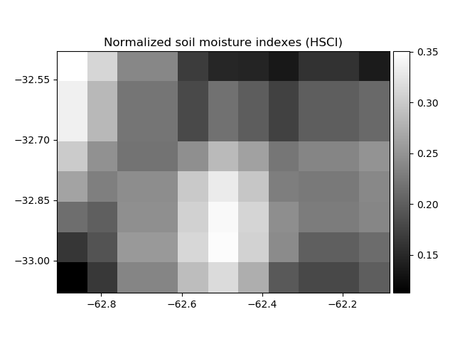

# Dryness-Indexes-Maps
Generates dryness indexes maps using SMAP images. The indices applied are:

- Temperature Condition Index (TCI)
- Normalized Soil Moisture Index (HSCI)

Satellite Data:

- SMAP Enhanced Level 3 Passive Soil Moisture Product (SMAP_L3_SM_P_E):  9 km spatial resolution

  
  

TCI  and  the  HSCI  varies  from  zero,  for  extremely  unfavorable  conditions,  to  1,  for  optimal conditions. 

References: 

 https://www.researchgate.net/publication/236577458_USE_OF_NOAAAVHRR-BASED_VEGETATION_CONDITION_INDEX_VCI_AND_TEMPERATURE_CONDITION_INDEX_TCI_FOR_DROUGHT_MONITORING_IN_THESSALY_GREECE

 https://nsidc.org/sites/nsidc.org/files/technical-references/D56292%20SMAP%20L3_SM_P_E%20PSD%20Version%201_0.pdf

Dependences:

    python - Gdal
    python - NumPy
    python - Matplolib

