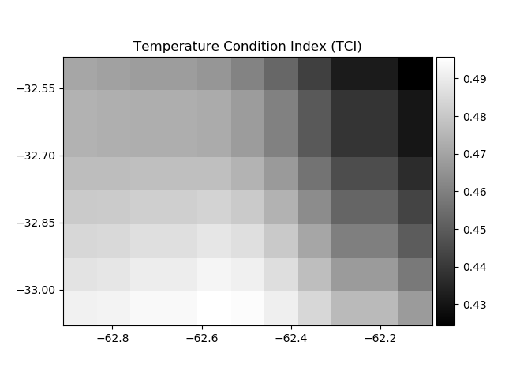

# Dryness-Indexes-Maps
Generates dryness Indexes Maps using SMAP images

Satellite Data:

SMAP_L3_SM_P_E (9 km spatial resolution)

  
  

Description:

Dependences:

    python - Gdal
    python - NumPy
    python - Matplolib

